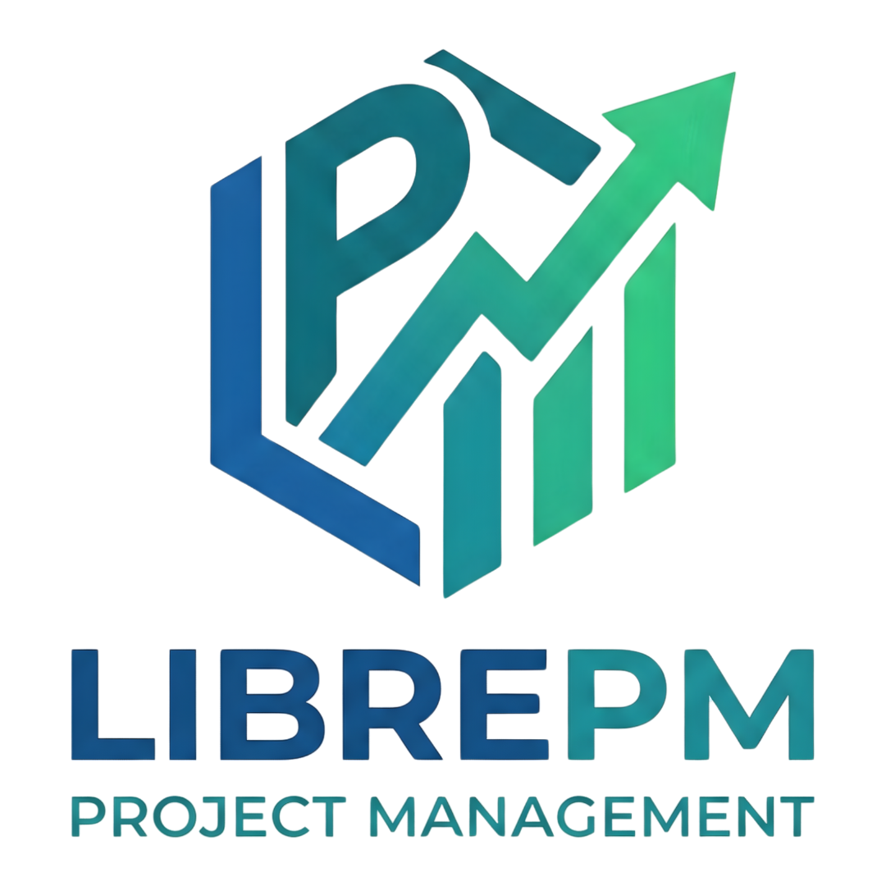

# LibrePM

**LibrePM** is a European project governance platform for project finance, grant management and operational planning — privacy-first, local-first, EU-oriented.

It enables individuals, teams, nonprofits, SMEs, professional studios, public-sector-adjacent organizations and research consortia to plan, finance, monitor, document and govern projects and programmes without relying on invasive telemetry or cloud lock-in.

## Positioning

| Axis | Summary |
|---|---|
| Identity | European project management and project governance platform, local-first |
| Value proposition | Govern work, plan, finance, grants, stakeholders and evolutives in the same domain |
| Competitive edge | Real privacy-first, data portability, local auditability, vertical templates, scenario branches |
| Deliberate boundary | Not an ERP, not general-ledger accounting, not people surveillance, not general-purpose BI |

## Core Principles

- **Zero telemetry by default** — no usage events, session analytics, heatmaps, session replay or fingerprinting
- **Zero third-party tracking** — no SDKs, pixels, trackers or dependencies that collect non-essential telemetry
- **Local data sovereignty** — the local workspace is the primary source of truth; cloud sync is optional and replaceable
- **Progressive complexity** — a simple task stays simple; advanced planning, finance and grants activate progressively
- **EU-ready by design** — privacy by design/default, accessibility, secure-by-design, portability, procurement readiness

## Features

### Core Work & Project Management
- Task management with priorities, deadlines, status workflows, tags and rich Markdown notes
- Task dependencies (FS, SS, FF, SF) with lead and lag
- Checklists and subtasks
- Views: List, Kanban Board, Timeline, Gantt, Workload, Calendar, Planner

### Advanced Planning & Execution Control
- WBS, milestones, summary tasks
- Baselines, variance tracking (schedule, effort), forecasting
- Work calendars, holidays, exceptions and capacity engine
- Resource allocation, workload slicing, ghost users, over-allocation alerts

### Project Finance, Grants & Governance
- Budget, cost lines, fund sources, commitments, burn rate, eligibility
- Grant and call registry, candidature tracking, submission packages, reporting obligations
- Donor registry, sponsor commitments, stakeholder governance
- Change control, scenario branches, compare and selective merge
- Evidence packs exportable for audit, sponsor review and grant reporting

### Executive Dashboard & Charter
- Project charter with team roles, goals and problem statement
- Business case, key success metrics (target vs. achieved)
- Risk register with severity/likelihood matrix and mitigation tracking
- OKR tracking aligned with project goals
- Deliverable tracking and high-level phase timelines

### Time Tracking & Analytics
- Focus sessions with integrated timer, heatmap visualization and session history
- Estimation deviation analysis (estimated vs. actual) for planning accuracy
- Ethical analytics derived from domain events, not from covert user behaviour

### Team & Collaboration
- Role-based access control (Owner, Admin, Editor, Viewer)
- Team management with members, followers/watchers and connections
- Ghost users for resource planning before account creation
- Notification system for assignments, status changes and mentions

### Privacy & Compliance
- Data map, retention policies, data subject rights (export, rectification, deletion, anonymization, portability)
- Role-gated visibility for financial data, sensitive stakeholders, donor registry, decision log, audit trail
- No dark patterns: symmetric opt-in/opt-out, clear controls, comprehensible preferences
- Cloud and transfer guardrails when extra-EU sync or integrations are activated

### Desktop Experience (Electron)
- Command Palette (Ctrl+K) for instant navigation and rapid creation
- Focus Timer with Pomodoro-style tracking and heatmap
- System notifications for reminders, focus events and assignment alerts
- Native file dialogs for import/export (JSON, CSV, `.db`)
- Linux/Wayland focus management for robust keyboard input recovery
- Light and Dark themes, Italian and English localization

## Architecture

### Stack

| Layer | Technology |
|---|---|
| Backend | Java 21, Spring Boot 3, Hibernate / Spring Data JPA, SQLite (JDBC), Flyway, Gradle |
| Frontend | Electron, React, Bootstrap / Custom CSS |

### Design

The architecture separates the frontend (Electron + React) from the backend (Java + Spring Boot). The backend serves as a headless API that runs embedded locally or can be hosted on a remote server.

Data is stored in SQLite for zero-configuration local storage. The database schema is managed via Flyway migrations (`src/main/resources/db/migration`), ensuring schema consistency across versions.

### Bounded Contexts

| Context | Responsibility |
|---|---|
| Work Management | Tasks, checklists, status, tagging, inbox, base assignments |
| Knowledge & Evidence | Notes, attachments, evidence, links, search, dossiers |
| Planning & Capacity | WBS, dependencies, calendar, Gantt, capacity, forecast |
| Execution Control | Baselines, variance, progress, risks, deliverable tracking |
| Finance & Funding | Budget, cost lines, fund sources, commitments, burn rate, eligibility |
| Grants & External Governance | Calls, candidatures, sponsors, donations, stakeholders, obligations |
| Branches & Change Governance | Change requests, scenarios, branches, compare, merge, spin-off |
| Privacy & Compliance | Data map, retention, DSR, access control, audit, consent boundaries |
| Open Interoperability | Import/export, calendar feeds, attachments, open schemas, connectors |
| Portfolio Light | Programmes, cross-project overview, funding and risk concentration |

### Workspace Profiles

| Profile | Primary Value |
|---|---|
| Personal / Independent | Tasks, notes, light planning, essential insights |
| Team Operations | Collaboration, boards, timeline, workload, executive dashboard |
| PM / PMO Light | Baselines, forecast, resource planning, branch compare, executive tracking |
| Nonprofit & Donations | Earmarked funds, donor management, reporting and evidence |
| Grant & Calls | Call registry, eligibility, submission packages, reporting obligations |
| Agency / Consultancy | Capacity, budget per deliverable, external stakeholders, sponsors |
| R&D Consortium | Partner organisations, work packages, deliverable register, co-funding, reviewer packs |

## Getting Started

### Prerequisites
- Java Development Kit (JDK) 21 or higher
- Node.js and npm

### Running the Backend

```bash
./gradlew bootRun
```

By default the application runs with the `desktop` profile, using a local SQLite database in the user's home directory.

### Building the Desktop App

```bash
cd desktop
npm install
npm run dist
```

This builds the backend JAR, the frontend, and packages everything into a distributable AppImage/DMG.

### Development Mode

```bash
# Terminal 1 — backend
./gradlew bootRun

# Terminal 2 — frontend + Electron
cd desktop
npm run dev
```

## Configuration

The application is configured via `application.yml`:

- `librepm.data.path` — root directory for database and asset storage
- `librepm.assets.allowed-extensions` — whitelist of file types allowed for upload
- `spring.profiles.active` — execution mode (`desktop`, `web`, `production`)

## License

Copyright (C) Lorenzo De Marco 2026 (Lorenzo DM)

This program is free software: you can redistribute it and/or modify it under the terms of the GNU Affero General Public License as published by the Free Software Foundation, either version 3 of the License, or (at your option) any later version.

This program is distributed in the hope that it will be useful, but WITHOUT ANY WARRANTY; without even the implied warranty of MERCHANTABILITY or FITNESS FOR A PARTICULAR PURPOSE. See the GNU Affero General Public License for more details.

You should have received a copy of the GNU Affero General Public License along with this program. If not, see <https://www.gnu.org/licenses/>.

See the [LICENSE](LICENSE) file for details.
